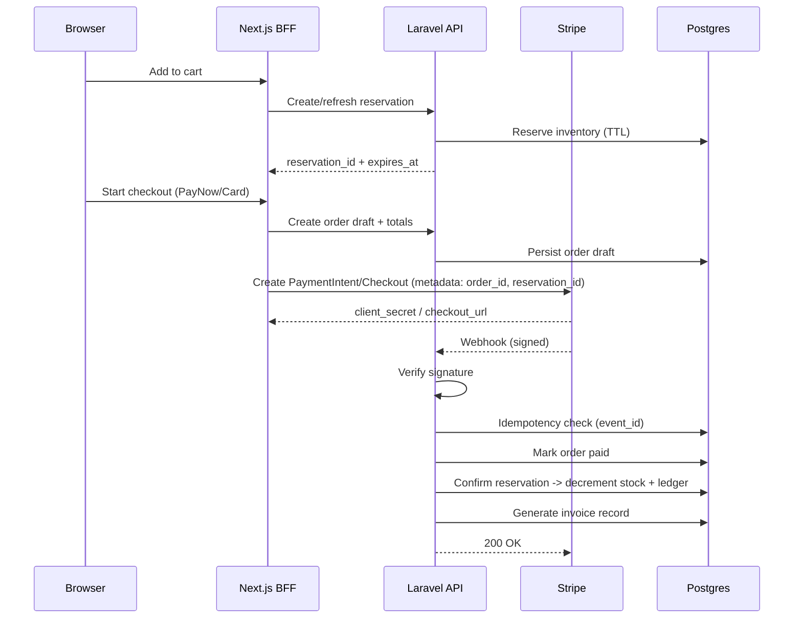

# Project Architecture Document (PAD)
## Merlion Brews — Artisan Coffee Crafted with Peranakan Soul

**Document status**: Finalized

---

## 1. Executive Summary
Merlion Brews is a Singapore-first, design-led headless commerce platform that preserves the bespoke Peranakan aesthetic defined in `cafe.html` while providing enterprise-grade transactional integrity and compliance. The system uses **Next.js 15 (App Router)** as a storefront **BFF** and rendering layer, **Laravel 12 (PHP 8.3+)** as the day‑1 domain API, **PostgreSQL 16** as the system of record with **two-phase inventory reservation + ledger auditing**, and **Stripe** as the payment processor with **PayNow** enabled via PaymentIntents. GST (9%) is treated as a first-class requirement across pricing display, order totals, and invoicing. For e‑invoicing, **InvoiceNow is in-scope for MVP** and will be implemented via an **InvoiceNow-ready provider API**, with auditability, retry, and reconciliation built in.

---

## 2. Goals, Non-goals, and Assumptions

### 2.1 Goals
- Preserve the **design system and interaction behaviors** encoded in `cafe.html`, including:
  - CSS layer architecture (`@layer tokens, base, components, utilities, overrides`).
  - Tokenized Peranakan palette with accessibility variants.
  - Signature components (e.g. `folio-frame`, Peranakan ornaments, zig-zag editorial layouts).
  - Accessibility behaviors (skip link, `:focus-visible`, `prefers-reduced-motion`, `prefers-contrast`).
  - “Emotional performance” (micro-interactions and narrative motion) without sacrificing Core Web Vitals.
- Ship an MVP with:
  - Full commerce: browse products, cart, checkout, receipt/invoice.
  - **Stripe + PayNow**.
  - Inventory oversell prevention.
  - GST-inclusive display and compliant invoice data.
  - InvoiceNow transmission via provider API.
- Provide a maintainable architecture with explicit decision records, clear ownership boundaries, and measurable validation gates.

### 2.2 Non-goals (MVP)
- Multi-warehouse fulfillment and advanced OMS.
- Custom payment processing outside Stripe.
- Multi-currency pricing beyond SGD.
- Full event-sourcing infrastructure (we use a ledger for auditability instead).

### 2.3 Assumptions & Constraints
- **Browser support floor**: Tailwind CSS v4 targets modern browsers and will not work on older browsers. We explicitly accept:
  - Safari 16.4+
  - Chrome 111+
  - Firefox 128+
  Source: Tailwind CSS Upgrade Guide — Browser requirements
  https://tailwindcss.com/docs/upgrade-guide
- Tailwind CSS v4 is adopted to align with:
  - Native cascade layers.
  - CSS-first configuration.
  - Token-to-CSS variable pipeline.
  Source: Tailwind CSS v4 release post
  https://tailwindcss.com/blog/tailwindcss-v4

---

## 3. Source-of-Truth Map (Authoritative Inputs)

### 3.1 UI / Design System / Interaction Authority
**Authoritative artifact**: `cafe.html`

The following are treated as non-negotiable requirements:
- CSS layer model and ordering semantics.
- Design tokens (colors, typography scale, spacing scale, easing, shadows, z-index).
- Accessibility defaults and fallbacks.
- Signature interaction patterns:
  - Mobile navigation with `aria-expanded`, focus behavior, escape-to-close.
  - Scroll reveal via IntersectionObserver.
  - Tiered animations with reduced-motion support.

### 3.2 Architecture & Domain Authority
**Authoritative artifacts**: `cafe_PAD_q.md` and `cafe_PAD_d.md` (reconciled)

- Next.js as BFF pattern.
- Laravel domain services.
- Inventory reservation + ledger.
- Stripe signature verification + idempotency.
- GST + PDPA requirements.

### 3.3 Business Registration + GST IDs (for invoices and footer)
**Authoritative artifact**: `cafe.html`

- Business Registration: **2015123456K**
- GST Registration: **M9-1234567-8**

---

## 4. Architecture Decision Records (ADRs)

### ADR-001 — Next.js as BFF (committed)
- **Decision**: Next.js 15 App Router acts as storefront renderer and BFF for UX-critical orchestration.
- **Rationale**:
  - Server Components for content-heavy pages and fast TTFB.
  - Ability to implement cart/checkout orchestration close to the user.
  - Separation: Laravel remains system of record for transactional domain integrity.

### ADR-002 — Laravel + Postgres day‑1 (committed)
- **Decision**: Laravel 12 and Postgres 16 are implemented from day 1.
- **Rationale**: InvoiceNow MVP, inventory integrity, and GST-compliant invoicing require authoritative server-side domain services and durable audit trails.

### ADR-003 — Tailwind CSS v4 (committed)
- **Decision**: Use Tailwind CSS v4.
- **Rationale**:
  - Native cascade layers and CSS-first configuration align with `cafe.html`.
  - Tokens become CSS variables by default.
  - Performance: v4 is a ground-up rewrite with faster builds.
  Sources:
  - Tailwind CSS v4 release post: https://tailwindcss.com/blog/tailwindcss-v4
  - Tailwind CSS upgrade guide (browser requirements): https://tailwindcss.com/docs/upgrade-guide

### ADR-004 — Inventory integrity via two-phase reservation + ledger (committed)
- **Decision**: Implement two-phase reservation (user-facing reservation, webhook-confirmed commit) with a ledger table for audit.
- **Rationale**: Prevent oversell, support payment timeout, enable reconciliation, preserve audit trail.

### ADR-005 — Stripe payments with PayNow required (committed)
- **Decision**: Stripe PaymentIntents/Checkout flows must support PayNow.
- **Rationale**: Singapore adoption; Stripe supports PayNow through payment method configuration.

### ADR-006 — InvoiceNow MVP via provider API (committed)
- **Decision**: Integrate with an InvoiceNow-ready provider’s API for invoice transmission.
- **Rationale**: Faster compliance delivery; provider handles access-point responsibilities.

---

## 5. High-Level System Architecture

### 5.1 Container Diagram
```mermaid
graph TD
  U[User Browser] -->|HTTPS| V[Vercel / Edge Network]
  V --> N[Next.js 15 App Router
Server Components + Route Handlers]
  N -->|BFF calls| L[Laravel 12 API
Domain Services]
  L --> P[(PostgreSQL 16)]
  L --> R[(Redis 7)
Cache + Queues]
  N -->|Payments| S[Stripe]
  S -->|Webhooks| L
  L -->|Invoice data| I[InvoiceNow-ready Provider API]
```

### 5.2 Responsibilities (clear ownership)
- **Next.js (BFF/UI)**
  - Renders marketing and content.
  - Hosts storefront endpoints for cart/checkout orchestration.
  - Enforces design tokens + component wrappers.
- **Laravel (Domain API)**
  - Products, inventory, orders, invoices.
  - Webhooks (Stripe) verification + idempotent processing.
  - InvoiceNow provider integration.
- **Postgres**
  - System-of-record for inventory, orders, invoices, and audit logs.
- **Redis**
  - Short-lived caching for catalog.
  - Queue backend for jobs (webhook processing, reservation expiry cleanup, invoice transmissions).

---

## 6. Frontend Architecture (Next.js 15)

### 6.1 Rendering Strategy
- **Server Components** by default for marketing/content pages.
- **Client Components** only for interactive islands (cart drawer, mobile nav, checkout form).
- **Caching**
  - Product catalog: ISR/edge caching.
  - Cart: client state + server validation on checkout.

### 6.2 Design-System-as-Architecture (from `cafe.html`)
The following must be preserved as first-class architectural constraints:
- CSS layers ordering:
  - tokens → base → components → utilities → overrides
- Global accessibility behavior:
  - `prefers-reduced-motion` reduces animation durations.
  - `prefers-contrast: more` overrides palette.
  - Skip link and `:focus-visible` outlines.
- Interactive behaviors:
  - Mobile menu open/close semantics and focus management.
  - Scroll reveal semantics.

---

## 7. Tailwind CSS v4 Strategy (Design Token Bridge)

### 7.1 Why Tailwind v4 is the correct fit
Tailwind v4 is designed around modern CSS primitives including native cascade layers and CSS-first configuration. It also states performance improvements from a rewritten engine. Sources:
- https://tailwindcss.com/blog/tailwindcss-v4

### 7.2 Configuration model
- Use `@import "tailwindcss";` (no `@tailwind base/components/utilities`). Source:
  - https://tailwindcss.com/docs/upgrade-guide
- Use CSS-first configuration:
  - `@theme { ... }` for tokens.

### 7.3 Layer alignment with `cafe.html`
We will preserve the design layers from `cafe.html` and integrate Tailwind v4’s layers without sacrificing the project’s conceptual layer model.

### 7.4 Custom utilities and variants
Because Tailwind v4 uses native cascade layers and no longer “hijacks” `@layer`, custom utilities that need variant support should be registered via `@utility`.
Source:
- https://tailwindcss.com/docs/upgrade-guide

---

## 8. Component Architecture

### 8.1 Principle
**Shadcn primitives provide discipline. Merlion wrappers preserve soul.**

### 8.2 Wrapper components (must exist)
- `ButtonMerlion`
  - Primary/secondary variants matching `.btn` rules.
  - Hover underlay animation.
- `CardMerlion`
  - `folio-frame` support.
- `OrnamentSystem`
  - SVG corner ornaments and path styling.
- `MerlionImage`
  - `folio-frame` wrapping and hover scale.
- `ZigzagSection`
  - Supports RTL flip behavior.
- `TextureOverlay`
  - Fixed overlay with controlled opacity.

### 8.3 Behavioral components (must exist)
- `MobileNavMerlion`
  - `aria-expanded` management.
  - Focus management and escape-to-close.
- `ScrollReveal`
  - IntersectionObserver-based reveal.

---

## 9. Backend Architecture (Laravel 12)

### 9.1 Domain services
- **Catalog Service**: Products, variants, pricing.
- **Inventory Service**: Reservation + confirmation + expiry.
- **Order Service**: Order lifecycle, totals, GST.
- **Payment Service**: Stripe session/intent bookkeeping and reconciliation.
- **Webhook Service**: Signature verification and idempotent event processing.
- **Invoice Service**:
  - Invoice numbering.
  - GST compliance fields.
  - InvoiceNow provider transmission.

### 9.2 Queueing model
- Stripe webhooks: enqueue processing, return 200 quickly.
- Reservation expiry worker: release inventory.
- InvoiceNow transmission worker: retry/backoff + alerting.

---

## 10. Data Architecture (PostgreSQL 16)

### 10.1 Inventory model (reservation + ledger)
- `inventory(sku, stock_count, reserved_count, updated_at)`
- `inventory_reservations(id, sku, quantity, expires_at, order_id, created_at)`
- `inventory_ledger(id, sku, change, reason, reference_id, created_at)`

### 10.2 Orders and GST
Orders store explicit cents fields:
- `subtotal_cents`, `gst_cents`, `total_cents`, `gst_rate`
- `gst_registration` (e.g. M9-1234567-8)
- `invoice_number` unique

### 10.3 Idempotency + webhook audit
- `webhook_events(provider, event_id, received_at, processed_at, status, payload_hash)`

### 10.4 InvoiceNow audit
- `invoices(id, invoice_number, order_id, totals..., transmitted_at, status)`
- `invoice_transmissions(id, invoice_id, provider_message_id, attempt, status, error, created_at)`

---

## 11. Checkout, Payments, and PayNow

### 11.1 Checkout flow (sequence)


### 11.2 Stripe requirements
- Signature verification required for all webhook events.
- Idempotency required for event processing.
- PayNow must be enabled for SGD flows.

---

## 12. Compliance (GST, PDPA, InvoiceNow)

### 12.1 GST
- Prices displayed to Singapore customers are GST-inclusive (as per `cafe.html`).
- Order totals must always store subtotal, GST, and total as separate fields.
- Invoice must include:
  - GST registration number: **M9-1234567-8**
  - GST amount breakdown
  - Unique invoice number

### 12.2 PDPA
- Newsletter subscription requires explicit consent capture.
- Data retention policy documented; invoices retained per regulatory requirements.

### 12.3 InvoiceNow (MVP via provider)
- Laravel generates the canonical invoice payload.
- Provider API integration responsibilities:
  - Authentication/credentials stored as secrets.
  - Transmission retries with backoff.
  - Audit log of attempts and provider response IDs.
  - Reconciliation job to detect stuck transmissions.

---

## 13. Security Model

### 13.1 Controls
- Stripe webhooks:
  - Signature verification.
  - Idempotent processing.
- Rate limiting:
  - Checkout endpoints (protect against abuse).
  - Webhook endpoint (protect against floods).
- Encryption:
  - Encrypt sensitive fields at rest where applicable.
- Audit logging:
  - Inventory ledger.
  - Payment events.
  - Invoice transmissions.

---

## 14. Performance and Emotional Performance

### 14.1 Tiered loading (emotionally intelligent)
- Tier 1: Critical content
- Tier 2: Interactions (nav/cart)
- Tier 3: Decorative textures/ornaments
- Tier 4: Ambient animations (e.g. floating beans)

### 14.2 Tailwind v4 performance rationale
Tailwind v4 states significant improvements in rebuild and incremental build performance, supporting fast iteration during design-fidelity work.
Source:
- https://tailwindcss.com/blog/tailwindcss-v4

---

## 15. Delivery Plan (MVP)

### Phase 0 — Foundations (Week 1)
- Monorepo structure: `/frontend` (Next.js), `/backend` (Laravel).
- Postgres 16 + Redis 7 provisioned.
- Tailwind v4 setup with token bridge strategy.
- Stripe configuration including PayNow.
- InvoiceNow provider onboarding.

### Phase 1 — Design Fidelity Backbone (Week 2-3)
- Token bridge implementation.
- Merlion wrapper components.
- Port `cafe.html` sections into Next.js pages.
- Visual regression tests.

### Phase 2 — Commerce Core (Week 4-5)
- Products, cart, checkout.
- Inventory reservation + ledger.
- Stripe PaymentIntents + webhooks (signed + idempotent).

### Phase 3 — Compliance MVP (Week 6)
- GST invoice generation.
- InvoiceNow provider integration + retry/audit.
- PDPA consent flows.

### Phase 4 — Hardening & Launch (Week 7-8)
- Load testing checkout.
- Monitoring and alerts.
- Reconciliation jobs.

---

## 16. Validation Gates

### 16.1 Pre-implementation validation
- Design token fidelity against `cafe.html`.
- Component wrapper fidelity (`folio-frame`, ornaments, zigzag, texture overlay).
- Accessibility:
  - Keyboard navigation, skip link, focus-visible.
  - `prefers-reduced-motion` honored.
  - `prefers-contrast: more` honored.
- Tailwind v4 browser floor accepted and documented.

### 16.2 Pre-launch validation
- Stripe:
  - Webhook signature verification active.
  - Idempotency prevents duplicate order/payment processing.
  - PayNow payments succeed end-to-end.
- Inventory:
  - No oversell under concurrency.
  - Expired reservations are released.
- GST:
  - GST-inclusive display everywhere.
  - Invoice totals correct and stored in cents.
- InvoiceNow:
  - Transmission succeeds via provider.
  - Retries and audit logs verified.

---

## Appendix A — Key `cafe.html` UI Requirements Checklist
- `@layer tokens, base, components, utilities, overrides` preserved conceptually.
- Texture overlay present.
- Hero:
  - floating beans
  - fade-up intro
- `folio-frame` double-border and hover lift.
- Peranakan ornaments (SVG corners).
- Zig-zag RTL layout behavior.
- Mobile menu:
  - aria-expanded toggle
  - escape-to-close
  - focus management
- Scroll reveal with IntersectionObserver.
- Footer includes:
  - Roastery address
  - Business registration and GST registration
  - GST inclusive pricing statement
