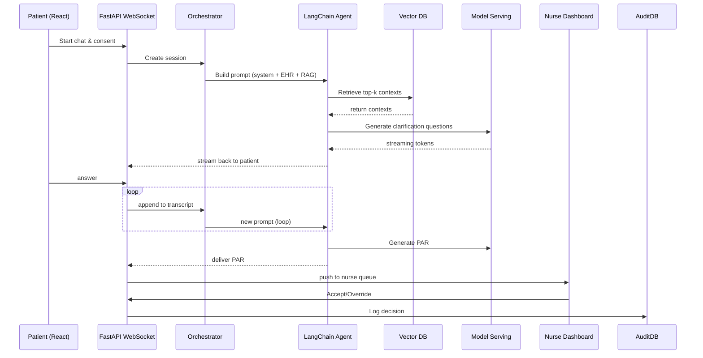
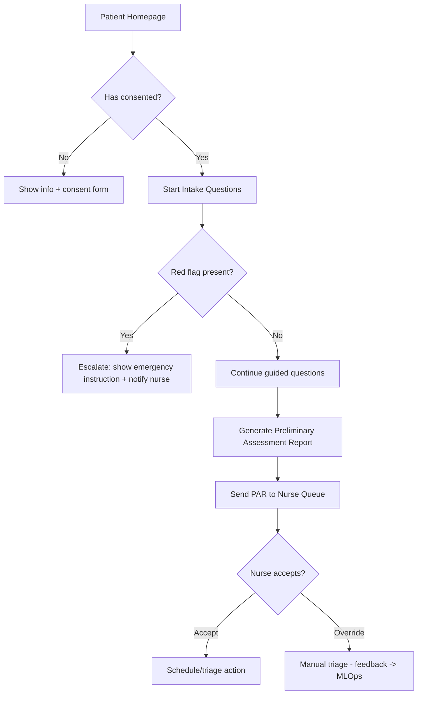

# Medical AI Assistant

**Repository:** [https://github.com/nordeim/Medical-AI-Assistant.git](https://github.com/nordeim/Medical-AI-Assistant.git)
**Version:** 1.0
**Maintainer:** Clinic AI Team (Chief AI Scientist — acting)

An end-to-end production-ready reference implementation for a **Medical AI Assistant** (clinic pre-screening & triage).
This repo contains architecture, training pipelines, a demo, dataset conversion tooling, a React frontend/chat UI, and a FastAPI backend with a LangChain v1.0 agent runtime for RAG-grounded, safety-controlled triage workflows.

> ⚠️ **Important:** This project is research / reference code. Do **not** run with real patient data or deploy in production without legal review, IRB/ethics approval, and rigorous clinical validation. Always de-identify PHI before using data for training or testing.

---

## Table of contents

* [Why this project exists](#why-this-project-exists)
* [Key features](#key-features)
* [Architecture overview](#architecture-overview)

  * [Application flow (Mermaid)](#application-flow-mermaid)
  * [User interaction flow (Mermaid)](#user-interaction-flow-mermaid)
* [Getting started (quickstart)](#getting-started-quickstart)
* [Local development (Docker Compose)](#local-development-docker-compose)

  * [Docker Compose example (Node + Postgres)](#docker-compose-example-node--postgres)
* [Running the demo (7B local demo)](#running-the-demo-7b-local-demo)
* [Training pipeline & dataset conversion](#training-pipeline--dataset-conversion)
* [Usage guide (agent application)](#usage-guide-agent-application)
* [Security, privacy & safety guidance](#security-privacy--safety-guidance)
* [Contributing & code of conduct](#contributing--code-of-conduct)
* [Roadmap & next steps](#roadmap--next-steps)
* [License & credits](#license--credits)

---

## Why this project exists

Busy family doctors and clinic nurses triage dozens of patients daily. The Medical AI Assistant helps automate the **first-mile** of patient screening — collecting symptoms, cross-referencing medical history, flagging red flags, and producing a structured **Preliminary Assessment Report (PAR)** for nurse review — while keeping strong human-in-loop and safety controls.

This repo codifies:

* A reproducible **LoRA/PEFT** training pipeline (with de-identify tooling).
* A **LangChain v1.0** agent runtime that orchestrates RAG + EHR lookup + LLM generation.
* A **React** chat frontend and a **FastAPI** WebSocket-enabled backend.
* Production guidance: Docker, k8s hints, retraining pipeline, monitoring and safety hooks.

---

## Key features

* **Patient chat** (friendly, guided collection of symptoms)
* **RAG-grounded responses**: integrates vector DB for local clinic guidelines & protocols
* **LoRA / PEFT training scripts** for cost-effective fine-tuning of open-source LLMs
* **Safety-first**: mandatory disclaimers, red-flag triggers, safety filter callbacks, nurse sign-off required
* **Human-in-loop workflow**: nurse dashboard with accept/override flows and audit trail
* **MLOps-ready**: adapter artifacts, model registry hooks, and retraining triggers

---

## Architecture overview

The system is broken into modular components so you can replace pieces (vector DB, model serving, or embedder) as needed.

```mermaid
flowchart LR
  subgraph Client
    Chat[React Patient Chat UI] -->|ws| Backend[FastAPI WS]
    Nurse[React Nurse Dashboard] -->|REST| Backend
  end

  Backend --> Orchestrator[Session Orchestrator]
  Orchestrator --> Agent[LangChain v1.0 Agent Runtime]
  Agent -->|retrieve| Vector[Vector DB (Chroma/Qdrant/Milvus)]
  Vector -->|contexts| Agent
  Agent --> Model[Model Serving (LLM + LoRA)]
  Model -->|stream| Backend
  Backend --> AuditDB[Audit & Logging DB]
  Nurse -->|review| AuditDB
  Agent --> EHR[EHR Connector (read-only summary)]
  EHR --> Agent
  AuditDB --> MLOps[MLOps / Training Pipeline]
  MLOps --> Model

  style Agent fill:#fff7ed,stroke:#f97316
  style Model fill:#eef2ff,stroke:#7c3aed
  style Vector fill:#ecfeff,stroke:#0891b2
```

### Application flow (Mermaid)



### User interaction flow (Mermaid)



---

## Getting started (quickstart)

> These instructions let you run the **developer demo** locally using Docker Compose (Node 22 Alpine for frontend/backend container and Postgres 17 Alpine for the DB). Replace model artifacts with smaller (7B) demo models for local testing.

1. **Clone the repo**

```bash
git clone https://github.com/nordeim/Medical-AI-Assistant.git
cd Medical-AI-Assistant
```

2. **Copy env template**

```bash
cp .env.example .env
# Edit .env: DATABASE_URL, SECRET_KEY, MODEL_PATH, VECTOR_STORE_PATH, etc.
```

3. **Start services (Docker Compose)**

```bash
docker compose up --build
```

4. **Open**

* React patient UI: `http://localhost:3000`
* Nurse dashboard: `http://localhost:3001` (or configured ports)

> For a local demo with limited GPU support, use the included `demo` folder and follow instructions in `demo/README.md`.

---

## Local development (Docker Compose)

This repo includes a `docker` folder with example Dockerfiles and `docker-compose.yml`. The main container uses `node:22-alpine` as requested, and the DB uses `postgres:17-alpine`.

### Docker Compose example (Node + Postgres)

> `docker/docker-compose.yml` (example)

```yaml
version: '3.8'
services:
  app:
    build:
      context: .
      dockerfile: docker/Dockerfile.app
    image: med-assistant-app:dev
    env_file: .env
    ports:
      - "3000:3000"  # React frontend (patient)
      - "8000:8000"  # FastAPI backend
    depends_on:
      - db
    volumes:
      - ./:/workspace
    networks:
      - mednet

  db:
    image: postgres:17-alpine
    environment:
      POSTGRES_USER: ${POSTGRES_USER:-meduser}
      POSTGRES_PASSWORD: ${POSTGRES_PASSWORD:-medpass}
      POSTGRES_DB: ${POSTGRES_DB:-meddb}
    volumes:
      - db-data:/var/lib/postgresql/data
    networks:
      - mednet

volumes:
  db-data:
networks:
  mednet:
```

### Dockerfile (main app) — `docker/Dockerfile.app`

```dockerfile
FROM node:22-alpine

WORKDIR /workspace
ENV PATH /workspace/node_modules/.bin:$PATH

# Install build deps
RUN apk add --no-cache python3 make g++ git

# Copy package.json, install deps
COPY package*.json ./
RUN npm ci

# Copy app
COPY . .

# Build frontend and start (entrypoint can run concurrently with backend using PM2 or use separate containers)
CMD ["npm", "run", "dev"]  # dev script can start both frontend and backend for dev
```

> **Production note:** In production we recommend separating frontend and backend containers and using a lightweight Nginx reverse proxy.

---

## Running the demo (7B local demo)

There is a demo in `demo/` which uses a smaller LLM (Mistral-7B-Instruct or other 7B model) so you can try the flow without massive GPU resources.

**Quick run**

```bash
cd demo
python -m venv .venv
source .venv/bin/activate
pip install -r requirements.txt
python generate_synthetic.py
python demo_train.py --data synthetic_small.jsonl --output_dir ./demo_lora --epochs 1
python demo_infer.py
```

**Notes**

* Use `load_in_8bit=True` for bitsandbytes quantized inference, ensure the host has supported CUDA.
* On CPU only setups, expect long runtimes — prefer trying with a smaller model or renting a GPU.

---

## Training pipeline & dataset conversion

This repo contains:

* `notebooks/Clinic_Dataset_Conversion_Notebook.ipynb` — de-identify & convert CSV EHR rows → JSONL instruction examples.
* `training/train.py` — LoRA + PEFT training script (DeepSpeed-compatible).
* `training/deepspeed_config.json` — example ZeRO-3 config for larger model training.
* `scripts/safety_callback.py` — runtime safety checks and logger callback hooks (OPTIONAL).

**Basic workflow**

1. De-identify & export clinic EHR (legal/IRB approval required).
2. Run dataset conversion notebook → generate `instruction_dataset.jsonl`.
3. Start training with `train.py` (or use `train_scheduler.sh` for cluster).
4. Save adapter weights (`lora_adapter/`) and register in model registry.
5. Deploy adapter to inference service and wire into LangChain agent.

**Sample training command**

```bash
deepspeed --num_gpus 8 training/train.py \
  --model_name_or_path /models/med-base \
  --data_path /data/instruction_dataset.jsonl \
  --output_dir /models/med-lora \
  --use_deepspeed \
  --deepspeed_config training/deepspeed_config.json
```

---

## Usage guide (agent application)

### High-level endpoints (example)

* `WS /ws/chat` — WebSocket endpoint for patient realtime chat
* `POST /api/v1/session` — create new session (returns session id and token)
* `GET /api/v1/nurse/queue` — nurse queue listing (requires RBAC token)
* `POST /api/v1/nurse/triage/{par_id}/action` — accept/override triage decision

### Example session lifecycle

1. **Create session** — frontend calls `POST /api/v1/session` with minimal metadata.
2. **Open WebSocket** — frontend opens `ws://.../ws/chat?session_id=...&token=...`.
3. **Agent loop** — backend orchestrator sends prompts to LangChain agent; agent performs RAG retrieval, EHR lookup, and triggers the model. The model streams clarifying questions back to the client.
4. **Complete intake** — agent generates PAR, backend persists it, and notifies nurse via dashboard.
5. **Nurse action** — nurse reviews, accepts, or overrides. Decision logged and optionally used to retrain.

### Prompting & system prompt

The agent uses the system prompt `Medical_AI_Assistant_v1.0` (see `prompts/system_prompt.md` in this repo) which encodes safety rules, output schema, role behavior, interaction protocols, and required disclaimers.

### RAG & traceability

* The agent logs `retrieved_docs` (ids + snippets) used to generate each PAR.
* Nurse dashboard shows the top-k retrieved contexts and a confidence/uncertainty score for transparency.

---

## Security, privacy & safety guidance

This section is critical — read carefully before testing with any clinical data.

* **PHI Handling:** NEVER upload identifiable patient data to external embedding services. Keep embeddings and vector DB on-prem or in a controlled VPC.
* **De-identification:** Use best-in-class de-id tools (and human spot checks) before using data for training. Follow local privacy laws (HIPAA/GDPR/etc.).
* **Human-in-loop:** For initial pilots, run the assistant in **shadow mode** — only suggest triage to nurses, never auto-act.
* **Safety Filters:** Use runtime safety callbacks to block outputs with prescriptive or definitive diagnostic language. Log safety hits to an alerting system.
* **Model provenance:** Always store model version, LoRA adapter hash, and training dataset snapshot with each PAR for auditability.
* **Clinical governance:** Clinical lead must sign off before any real-world deployment.

---

## Contributing & code of conduct

We welcome contributors! To make collaboration smooth, please follow these steps:

1. Read `CONTRIBUTING.md` and `CODE_OF_CONDUCT.md`.
2. Open an issue to discuss major changes before working on a large feature.
3. Use feature branches: `git checkout -b feat/your-feature`.
4. Keep PRs small & focused; include tests and update docs.
5. All contributions require at least one approval from a repo maintainer.

**Suggested starter tasks for new contributors**

* Improve the React UI accessibility & i18n.
* Add more safety tests & test fixtures.
* Add CI tests for linting, unit tests for backend, and a demo GitHub Action to run the local demo.

---

## Roadmap & next steps

Short-term:

* Implement LangChain agent skeleton (complete) and provide sample RAG corpora.
* Add integration tests for the train → adapter → inference pipeline.

Medium-term:

* Nurse dashboard UX polish and analytics (nurse acceptance metrics).
* Add secure, auditable model registry and adapter hot-swap for A/B testing.

Long-term:

* Multi-clinic deployments, multilingual support, and voice integrations.

---

## License & credits

* **License:** MIT (suggested) — include `LICENSE` in repo root.
* **Acknowledgements:** This project builds on many open-source tools and research (LangChain, Hugging Face Transformers, PEFT, bitsandbytes, Chroma/Qdrant/Milvus). Credit to the original authors of those projects.

---

## Appendix

### Suggested repository layout

```
/
├─ .github/                # Actions, issue templates
├─ docker/
│  ├─ Dockerfile.app
│  └─ docker-compose.yml
├─ frontend/               # React app
├─ backend/                # FastAPI app + LangChain orchestrator
├─ training/               # train.py, deepspeed config, scripts
├─ demo/                   # small 7B demo (generate_synthetic / demo_train / demo_infer)
├─ notebooks/              # dataset conversion notebook
├─ prompts/                # system_prompt.md
├─ docs/                   # technical docs, PRD, runbooks
├─ scripts/                # helper scripts (safety, eval)
├─ .env.example
└─ README.md
```

---

## Contact & maintainers

For questions, feature requests, or clinical partnerships, open an issue on this repo or email `clinic-ai-team@yourclinic.example` (link placeholder).

